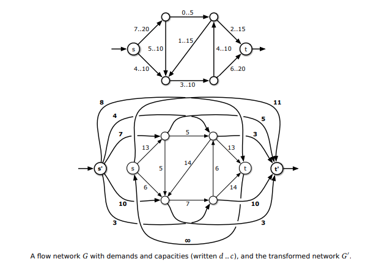

- ⊚ Wikipedia (digraph: 02)
- ₤ より良い解法がありそう (digraph: Li)
- ℗ 関連した問題が面白そう (digraph: PO)
- ⑉ OEIS (digraph: 4j)
- ✠ スキップです……(digraph: -X)

## 2-1 全探索

- IDDFS: Iterative Deepening Depth-First Search というものがあるようです。
- ⊚ Subset sum problem
- ⊚ 3SUM

## 2-2 貪欲法

- ₤ best Cow Line 線形で解けそう

## 2-3 DP

- ⊚ Knapsack problem
- ℗ 復元系全般
    - ナップザック
    - 部分和
    - LCS
    - LIS
- ⊚ Partition number / Partition function

- ここで求めている分割数は、$\mathcal P _ n ^ { ( m ) }$ のことのようです。
    - ヤング図形でいう、左側を削っていくイメージ
    - 対角成分をとるといわゆる分割関数 $\mathcal P _ n$ 
    - ⑉ 000041: Partition function
    - ⑉ 008284: Partiton triangle

- 個数制約つき重複組み合わせ、けっこう難しいですね。
- ⊚ Combination: 二項係数など
- ⊚ Multiset

## 2-4 データ構造

- ✠ 二分探索木が地獄なのですが、あの‥‥
- [https://docs.rs/binary-tree/0.2.0/binary_tree/](https://docs.rs/binary-tree/0.2.0/binary_tree/)

- 情報の整合性といえば、Union-Find

## 2-5 グラフ

- ℗  負閉路の復元
- ⊚ Greedoid
    - accessible: 必ずひとつ減らせる
    - exchange: 解とよい解があるとき、よい解からひとつもらえる
- ⊚ Reverse-delete: Kruscal を逆からやるようです。

- 牛ゲー

## 2-6 数学的な問題を解くコツ

### 乱択系の素数判定
- ⊚ フェルマーテスト
- ⊚ ポラード・ロー
- ⊚ ミラー−ラビン
- ⊚ AKS: なんと多項式時間（7.5 乗）
- ⊚ Carmichael numer

### 篩
- ⊚ Sieve of Eratosthenes から様々な篩にリンクがあります。
- アトキンが速いらしい。Spaghetti Source にも実装がありです。

### 素数べき

- ℗ Carmichael 数判定の高速化
    - $\langle O \left ( 1 \right ) O \left ( \sqrt n \right ) \rangle$
    - $\langle O \left ( n \right ) O \left ( 1 \right ) \rangle$

## 3-2 テク

### 尺取り法

-℗ 負もあるときってどうなんでしょう。

### 反転

- Fliptile は、わざと一列消費して自分を追い込んでいくことで見えてくる道があるという教訓があります。
- ℗ 判定だけならもっと大きくてもできるとかないかな。

### Fliptile

こういうのデバッグ方針難しいですよね。

### ビット演算

- [ビット列による部分集合表現 【ビット演算テクニック Advent Calendar 2016 1日目】 - prime's diary](https://primenumber.hatenadiary.jp/entry/2016/12/01/000000)
- 「隣り合う要素を同時に含まない集合」ができました。すごくありませんか？
    - 個数はフィボナッチですね。指数の底が小さくなってちょっと嬉しいかも。

### 巨大ナップサック

マージ＆尺取りの爆速実装です。

### 座標圧縮

グリッドかなり面倒ですし、（一時的に負にもなれる？）clamp を作っておいても良いかも

### crane

むっず！ やることは簡単で、本のとおりにやらなくても複素数のアフィン変換でいけます。
でも実装……

### 2 冪でなくするの

あり本ですと、右下にノードが追加される方式のようです。
これ切り下げしたところを切り上げにすれば左下に来たりしない？

### 2 次元

セグツリーに比べると簡単？ 抽象化していなからというのもありそうです。

### 遅延セグ木

私が知っているのとずいぶん違います。
いわゆる遅延配列からもとの配列へは作用しないのですね。

不変条件はこれでしょうか。
区間 $l, r$ に対応する節点が $k$ として、真の合計が
$$
    \mathtt { sum }
        = \mathtt { datb } _ k
        + \sum _ { j = k, p(k), p^2(k), \dots } \mathtt { data } _ j
$$
になっています。が成り立ちます。（ただし $p$ は親です。）

つまり、$\mathtt { data }$ のほうがいわゆる遅延配列です。

### Range add BIT

かなりぎょっとするのですがとても汎用性が高そうです。

普通の BIT の `prefix_sum` 関数は、数列 $a$ に依存する関数 $f ^ a ( i ) = \sum _ { j = 0 } ^ { i - 1 } a _ j$
でクエリしていると思うことができます。
特徴としては、一度構築したあとでも一点変更が高速に達成できることです。

一点変更をすることは、$a$ に $\epsilon _ i = (0, 0, \dots,\overset { i } 1, \dots, 0)$ を
足すことと同じです。
これをするとクエリの結果はこのように変わります。
$$
    \Delta _ i f ^ a ( j ) =
    f ^ { a + \epsilon _ i } ( j )  - f ^ a ( j ) =
    \begin {cases}
        0         & j \le i   \\
        1         & i \lt j
    \end {cases}
$$
$i + 1, i + 2, \dots$ のクエリ結果に $1$ を足されていることがわかるでしょう。

この考え方で行くと、どうにかして折れ曲がった $1$ 次式を足すことができれば勝ちです。
では、`prefix_sum` 関数の代わりに $f ^ a _ 1( i ) = i f ^ a ( i )$を使ってみましょう。
するとあら不思議、このようにずっと $0$ なのにいきなり $i$ までジャンプして順調に増加していく謎関数を足すことができました。
$$
    \Delta _ i f _ 1 ( j ) =
    f _ 1 ^ { a + \epsilon _ i } ( i )  - f _ 1 ^ a ( i ) =
    \begin {cases}
        0         & j \le i   \\
        j         & i \lt j
    \end {cases}
$$

あとはこれを調整して、こうです。（場合分けの境界を区別する必要がなくなりましたから、両方に等号を入れてしまいました。）
$$
    \Delta _ i \left ( f _ 1 - i f _ 0 \right ) ( j ) =
    \begin {cases}
        0         & j \le i   \\
        j - i     & i \le j
    \end {cases}
$$
これは、$a$ がなんらかの配列の累積和と思うと、$i, i + 1, i + 2, \dots$ に $1$ を足すのと同じです。

ということで、区間 $l , r$ に $1$ を足したいときには、これをするとよいです。
$$
    \left ( \Delta _ l \left ( f _ 1 - l f _ 0 \right ) - \Delta _ r \left ( f _ 1 - r f _ 0 \right )  \right ) ( j ) =
    \begin {cases}
        0           & j \le l           \\
        j - l       & l \le j \le r     \\
        r - l       & r \le j
    \end {cases}
$$

これは、区間加算して累積和をするのと同じです。

というのがたぶんネタ元でしょう。$i$ の代わりに $i ^ 2$ や $\sin i$ などを足すといろいろできそうです。

正直テストもたいしてできていないですが、まずは先に進みましょう。

### k-th number

平方分割とセグツリーどっちでもけっこうきれいにできてすごいです。

平方分割はかなり典型の見た目をしています。
セグツリーは、面白いですね。
いわゆる領域木に発展するようです。

- ⊚ Segment tree
- ⊚ Interval tree
    - Boost. Isl ふーん‥‥
- ⊚ Range tree

## 3-4 動的計画法

### TSP

- 逆からやるんですね。
- あり本でいう `v` のループに `filter` がないの、変だなぁと思っていたのですが、なるほどスタートは未訪問なのですね。

### ドミノ

ほんのやり方を理解しようと粘ったのですが、謎すぎます。後ろから貰う DP に見えるのですが、
遷移の詳細はむしろ配っている感じだったり後ろに遷移する感じだったりのほうがフレンドリーです。

結局普通に解いてしまいました。

## 3-5 ネットワークフロー

FF が $\Theta \left ( F \lvert E \rvert \right )$ かかるケースが知りたいです。

[van Emde Boas tree （謎木）](https://www.slideshare.net/catupper/nazoki)

### 流量下限付き

これ相当ややこしいです。

#### すぬけさんの記事
[最小流量制限付き最大流 - あなたは嘘つきですかと聞かれたら「YES」と答えるブログ](https://snuke.hatenablog.com/entry/2016/07/10/043918)

#### Wikipedia

[Maximum flow problem - Wikipedia](https://en.wikipedia.org/wiki/Maximum_flow_problem)

#### かなりよい講義資料

[25-maxflowext.pdf](https://courses.engr.illinois.edu/cs498dl1/sp2015/notes/25-maxflowext.pdf)

一応親ページもあるよう。

[Bioinformatics Lecture Slides](https://www.cs.cmu.edu/~ckingsf/bioinfo-lectures/)

#### 考えたこと

結局講義資料のやり方が良さそう？
あり本とすぬけさんはちょっとよくわりませんでした……

##### 難しい点

まず流量下限付きのなにが難しいかというと、そもそもスタート地点が feasible でないので、
まずは feasible にたどり着かないといけないという課題があります。

##### feasible さえあれば勝ち

逆に feasible flow さえ得られたらそこから Ford -- Fulkerson をすればよさそうで、正当性はこれです。
カット $(S, T)$ の容量をこちらで定義します。
$$
    \newcommand {\Edges} { \mathrm { Edges } }
    \sum _ { e \in \Edges (S, T) } c ( e ) - \sum _ { e \in \Edges ( T, S ) } b ( e )
$$

すると、あらゆる feasible flow はあらゆるカットの容量以下であることがわかります。（弱双対性）
さらに feasible flow が（最小流量を守る意味での）augumenting path を持たないとすると、$s$ から到達可能な頂点全体の集合 $S$ を考えると、
$S$ から出ている辺はすべて飽和していて、$S$ に入る辺も最低流量以上は流れていないことがわかります。
ということで、カット $(S, V \setminus S)$ の容量はこの flow の流量と同じなので、
最大流・最小カット定理の亜種が成り立ちます。

##### feasible がほしい

講義資料ですと $t\rightarrow s$ に無限容量の辺を貼るところが特徴的かもです。
ほとんど強調されていなくて見逃すところでした。

あと $G$ の $t \rightarrow s$ と $\hat G$ の $t' \rightarrow s'$ がずっと気になっていたのですが、
これ単に source と sink ですね。てっきり無限遠（？）から辺があるのかと。

資料に従うと、$G$ の feasible flow が存在することは、$G'$ の saturating flow （$s'$ から出ている辺、$t'$ に入る辺がすべて飽和）と同値です。( Lemma 1 )
証明は二方向の対応を作っているのですが、よく考えるとこれは全単射的な対応になっていることもわかります。

##### 実装

$s' \rightarrow t'$, $s \rightarrow t$ というふうに $2$ 回流します。

一回目のランで saturating にならなければ `"Impossible"` ですね。
そうでないときには、グラフはこのようになっています。
- もとのネットワークに制限すると、容量から feasible flow が差し引かれたものになっています。
- $s', t'$ 関連の辺はすべて飽和していて、逆も $s \rightarrow t$ の途中では到達不能、よってないものとしてみても良いです。
- $t$ から $s$ に伸びる無限容量の辺も、正向きは到達不能です。
- 逆向きは、$s$ から $t$ まで直通で流せて、これの容量が差し引いた feasible flow の容量に等しいです。
- というわけで、こうしてできたネットワークに普通にフローを流すとできます。

ところで復元かなりややこしそうですね……
普通の Ford -- Fulkerson の復元ならば毎回増分路がわかるのでよいのですが、
一回目のランのときの増分路が難しそうです。
$s \rightarrow v \rightarrow \dots \rightarrow u \rightarrow t$ みたいな形で、
実際に $u \rightarrow v$ に容量十分な辺があるならば切り貼りでできそうなのですが、
一般にはそううまくもいかなそうです。

### 容量の decrease

$u \rightarrow v$ を $1$ だけ decrease したいとしましょう。（$2$ 以上でもできるはずなのですが、頭が混乱してきました。）

飽和していなければ、こっそり decrease してもばれません。
飽和している場合、残余パス $u \rightarrow \dots \rightarrow v$ があればそれに沿って押し戻して、
辺 $u \rightarrow v$ の流量を $1$ 減少させると良いです。

だめそうなときにも、$u \rightarrow \dots \rightarrow s, v \rightarrow \dots \rightarrow t$ はかならず流せますから、
そちらで妥協をして、最大流を $1$ 減少です。

### Dinic

こちらに注意です。
[twitter のリプライで頂いた注意](https://twitter.com/Mi_Sawa/status/1291765432072822784)

できました。うれしいです。

### Tutte

掃き出し法が難しそうです。

のしさん助けて！ [twitter のリプライです。](https://twitter.com/noshi91/status/1242075700577710081)

乱択アルゴリズム、あまり存ぜずですが、レパートリに入れておきましょう。

### 最小費用流

かなり辛くなってきました。グラフの複雑なアルゴリズムは、Rust でもはまりがちです。

### 最小費用流の負辺除去

安定のすぬけさん。[最小費用流の負辺除去 - あなたは嘘つきですかと聞かれたら「YES」と答えるブログ](https://snuke.hatenablog.com/entry/2017/06/07/115821)

すぬけさんシリーズ全部読んでみても良いかもです。

- Bellman-Fordでポテンシャル初期化(負の閉路無し) O(F m log n + nm)．
    - これ実装してないのでまたやりたいです。（Dijkstra ポテンシャル初期化と Bellman-ford オンリーは書いたので、たぶん書ける？）
- 適当に定数足して非負に (大きさFの最大重み二部マッチングなど) O(F m log n)．
    - これも実装していないけれどたぶん簡単。
- 予めmaxまで流して負辺除去 O((F+F') m log n), F'は負の辺の容量の和．
    - これがあり本のコラムのところでしょうか。Demand を考えるのと同じと見て良い？

## 3-6 平面幾何

[アルゴリズム - PukiWiki](https://home.wakatabe.com/ryo/wiki/index.php?%E3%82%A2%E3%83%AB%E3%82%B4%E3%83%AA%E3%82%BA%E3%83%A0)

これ充実しててすごい。

### CCW

全然文献がないです。ほんとにこんなお名前なのですか？

[Geometric Primitives](https://algs4.cs.princeton.edu/91primitives/)

### 凸包

$O \left ( M ^ { 2 / 3 } \right )$ 点なのですか。結構少ないです。

matsu さんのブログです。[2次元の凸包を求めるアルゴリズムと応用について - matsu7874のブログ](https://matsu7874.hatenablog.com/entry/2018/12/17/025713)
